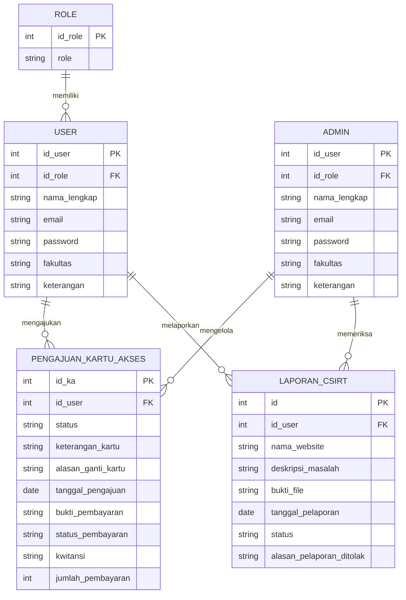

# AccessTrack — Security Incident & Access Card Management System

AccessTrack adalah sistem berbasis web yang dikembangkan untuk mendigitalisasi proses pelaporan insiden keamanan siber (CSIRT) dan pengajuan kartu akses di lingkungan SISFO (Sistem Informasi) Universitas Jenderal Achmad Yani (UNJANI).

## Latar Belakang
Sebelumnya, pelaporan insiden keamanan dilakukan secara tidak terstruktur melalui chat/email pribadi ke tim SISFO, dan pengajuan kartu akses mengharuskan pengguna datang langsung ke kantor dengan waktu tunggu 30–60 menit tanpa notifikasi status. AccessTrack dibangun untuk mengatasi kedua masalah ini sekaligus menyediakan rekap laporan bulanan yang sebelumnya tidak tersedia.

## Fitur Utama
- **Pelaporan Insiden Keamanan (CSIRT)** — pelaporan insiden siber dengan upload bukti file, deskripsi masalah, dan status tracking (termasuk alasan penolakan)
- **Pengajuan Kartu Akses** — alur pengajuan online dengan upload bukti pembayaran, status pembayaran, dan kwitansi otomatis
- **Role-based Access** — 2 role utama: Admin (Tim SISFO) dan User (mahasiswa/dosen/TENDIK)
- **Riwayat & Pemantauan Status** — pemantauan status laporan/pengajuan secara real-time
- **Export Kwitansi** — bukti pembayaran otomatis (mengatasi masalah kwitansi fisik hilang)

## Tech Stack
| Layer | Teknologi |
|---|---|
| Backend Framework | CodeIgniter 3 (PHP, arsitektur MVC) |
| Database | MariaDB |
| PDF Generation | Dompdf (kwitansi & laporan) |
| Dependency Manager | Composer |
| Metodologi | SDLC Waterfall |

## Entity Relationship Diagram

Sistem terdiri dari 4 entitas utama:
- **User** — menyimpan data pengguna (mahasiswa/dosen/TENDIK) dengan role dan fakultas
- **Admin** — akun pengelola sistem (Tim SISFO)
- **Pengajuan_Kartu_Akses** — data pengajuan kartu akses (status, bukti pembayaran, kwitansi)
- **Laporan_CSIRT** — data pelaporan insiden keamanan (deskripsi, bukti file, status)

## Entity Relationship Diagram



## Project Structure

```
AccessTrack/
├── application/
│   ├── controllers/
│   │   ├── Auth.php          # Login, registrasi, & session handling
│   │   ├── Admin.php         # Dashboard & aksi admin (approve/reject pengajuan & laporan)
│   │   └── User.php          # Dashboard user, form pengajuan & pelaporan
│   ├── models/
│   │   ├── Model_Auth.php       # Query autentikasi & role checking
│   │   ├── Model_Pengguna.php   # CRUD data user
│   │   ├── Model_Pengajuan.php  # CRUD pengajuan kartu akses & status pembayaran
│   │   └── Model_CSIRT.php      # CRUD laporan insiden keamanan
│   ├── views/           # Tampilan per role (admin & user)
│   ├── config/           # Konfigurasi database, base URL, autoload
│   └── helpers/           # Fungsi bantu kustom
├── assets/
│   ├── css/, scss/, js/      # Styling & interaktivitas frontend
│   └── kwitansi/                # Template & output bukti pembayaran (PDF)
├── system/                        # Core CodeIgniter 3 framework
├── vendor/                         # Dependency Composer (Dompdf, PHPOffice, dll.)
└── composer.json
```

## Testing
Diuji menggunakan **Black Box Testing** (fungsional) dan **User Acceptance Testing/UAT** untuk memastikan sistem sesuai kebutuhan pengguna sebelum deployment.

## Peran Saya
Web Developer — bertanggung jawab pada pengembangan backend meliputi business logic pada `Auth`, `Admin`, dan `User` controllers, desain & implementasi model data (`Model_Pengajuan`, `Model_CSIRT`), generate kwitansi PDF (Dompdf), dan sistem notifikasi email, mengikuti arsitektur MVC dengan CodeIgniter 3.
